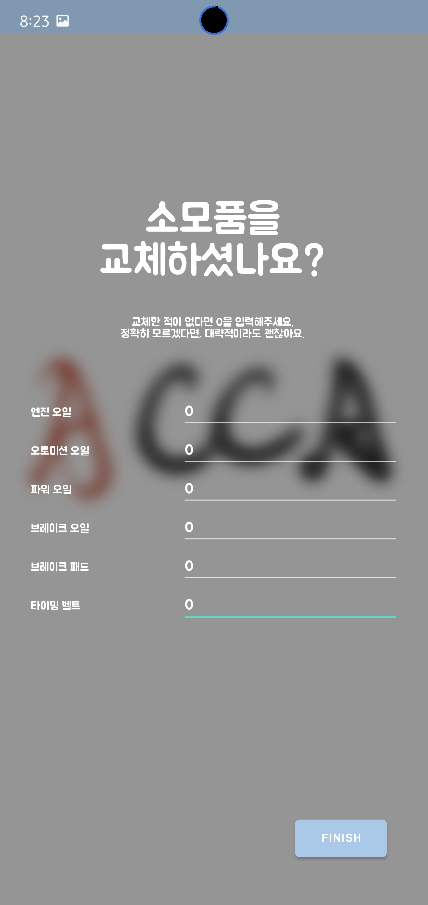

ACCA_kotlin
===========
JAVA로 작성되었던 졸업작품인 ACCA를 코틀린으로 리팩토링 및 개선 하였습니다.   

사용 기술 및 라이브러리
---------
+ kotlin
+ MVVM
+ AAC (ViewModel, LiveData, Room, Navigation)
+ DataBinding
+ Retrofit2
+ Ted Permission

개요
----
최근 출시되는 자동차의 경우, 자동차를 관리할 수 있는 자체 시스템이 탑재되어 출시됩니다.   
하지만 출고 후 10년에서 길게는 20년까지 사용하는 자동차의 특성 상 관리 시스템의 혜택을 받지 못하는 경우가 많습니다.   
또, 자체 시스템은 매달 결제해야하는 구독형으로 가격에 부담을 느끼는 소비자가 있을 수 있습니다.      
ACCA는 구형 차주들을 위한 차량관리 차계부 앱입니다.   
귀찮아서, 번거로워서 작성하지 못했던 차계부를 자동으로 작성해주고, 작성된 차계부 데이터를 기반으로   
연비와 차량정비 기능을 제공합니다.

기능
----
1. 앱 최초 실행 시, 유저의 데이터를 입력받고 앱을 세팅   
</img>
</img>
</img> 

유저의 기존 차량정보를 입력받아 앱에 등록합니다.   
등록된 정보는 SharedPreferences, Room을 이용한 DB에 저장되어 관리됩니다.     

2. 주행거리 자동 저장   
</img>
</img> 

주행 시작 시, 스마트폰의 위치정보를 받아와 이를 기반으로 주행거리를 측정합니다.   
주행거리는 LiveData를 활용하여, 실시간으로 업데이트 됩니다.   

주행 종료 시, 주행 거리를 DB에 저장합니다.     

3. 주행거리를 기반으로 한 차량 정비   
</img>
</img> 

앱을 사용하며 쌓이는 주행 정보를 기반으로 차량의 주요 소모품의 교체 주기를 제공합니다.   
교체까지 남은 거리를 계산하여 구간별로 파랑, 노랑, 빨강의 글씨로 표시됩니다.   
소모품 교체까지 얼마 남지 않은 빨강의 경우, 사용자에게 푸시알림을 보내 정비가 필요함을 알립니다.     

4. 주유 이력 자동 저장   
</img>
</img>
</img> 

주행 중, 주유소에 들러 주유 한 뒤에 카드 결제 SMS를 수신한다면 앱이 스스로 주유 기록에 저장합니다.   
BroadcastReceiver를 이용해, 앱이 백그라운드로 내려가도 해당 기능은 작동합니다.
SMS가 수신되고 앱이 주유 결제 SMS라고 판단했을 경우, 현 시점의 GPS 정보를 받아옵니다.  
수신한 GPS 정보를 KATEC 좌표로 변한한 뒤, 이를 활용하여 Retrofit2를 통해 Opinet API를 호출합니다.   
결과값과 주유 정보를 DB에 저장하고, 이 후 사용자가 확인할 수 있습니다.  

만약 카드결제 SMS를 수신받지 않는 사용자의 경우, 스스로 입력할 수 있는 기능이 준비되어 있습니다. 
